# Jamf Dash
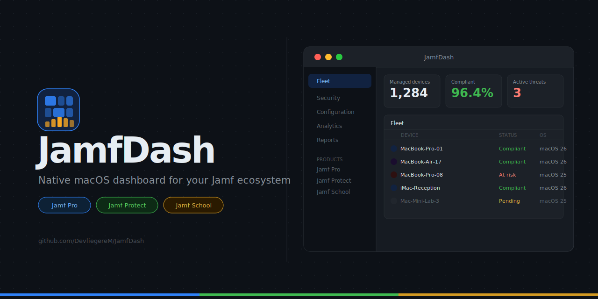

---

---

## Overview

Jamf Dash connects to your Jamf environment via [`jamf-cli`](https://github.com/jamf-concepts/jamf-cli), an open-source CLI maintained by Jamf Concepts. The app downloads and manages `jamf-cli` automatically — no manual installation required.

**Supported products:**

| Product | Sections |
|---|---|
| Jamf Pro | Overview · Security Posture · Fleet & Config · Devices · Mobile Devices · Device Lookup · Reports · Bulk Actions · Org Browser · Extension Attributes · Patch Management · Enrollment · Webhooks · Blueprints · Compliance Benchmarks |
| Jamf Protect | Overview · Events · Computers · Plans · Alerts · Insights · Audit Logs · Removable Storage · Unified Logging · Action Configs · Telemetry · Prevent Lists · Roles · Users · Groups · API Clients |
| Jamf School | Overview · Devices · Device Groups · Users · User Groups · Classes · Apps |

---

## Requirements

- macOS 14 Sonoma or later
- A Jamf Pro, Jamf Protect, or Jamf School account with API access
- An internet connection for the initial `jamf-cli` download

---

## Setup

Jamf Dash guides you through a step-by-step onboarding flow on first launch:

1. **Welcome** — introduction, or try Demo Mode without any credentials
2. **Install jamf-cli** — the binary is downloaded automatically from Jamf Concepts
3. **Choose product** — Jamf Pro, Jamf Protect, or Jamf School
4. **Authenticate** — product-specific credentials (see below)

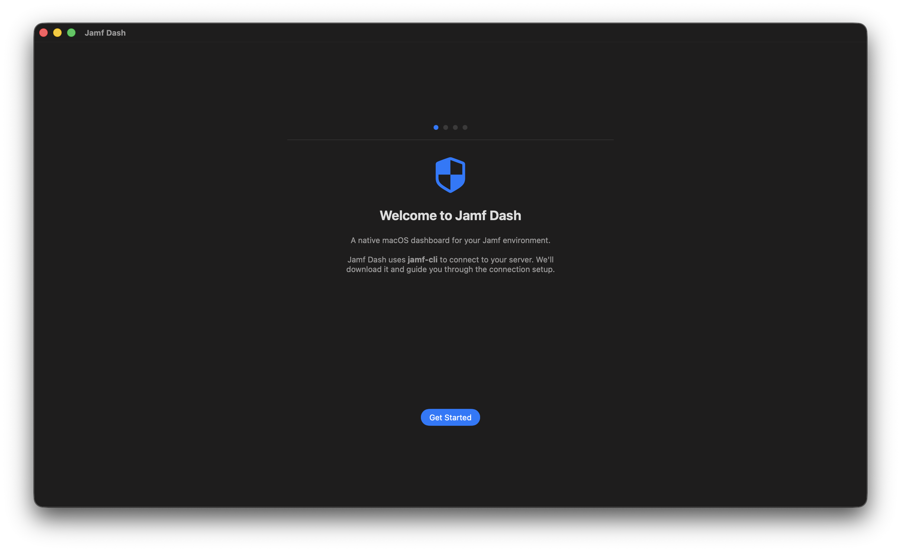

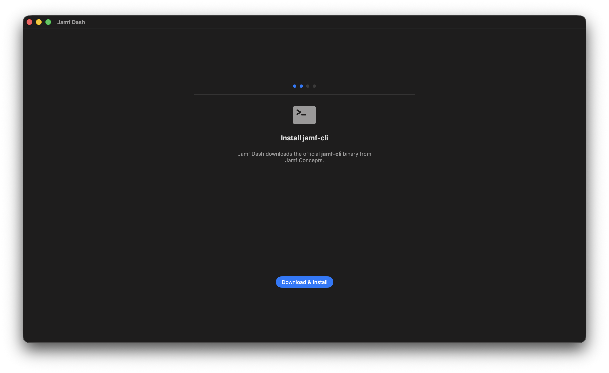

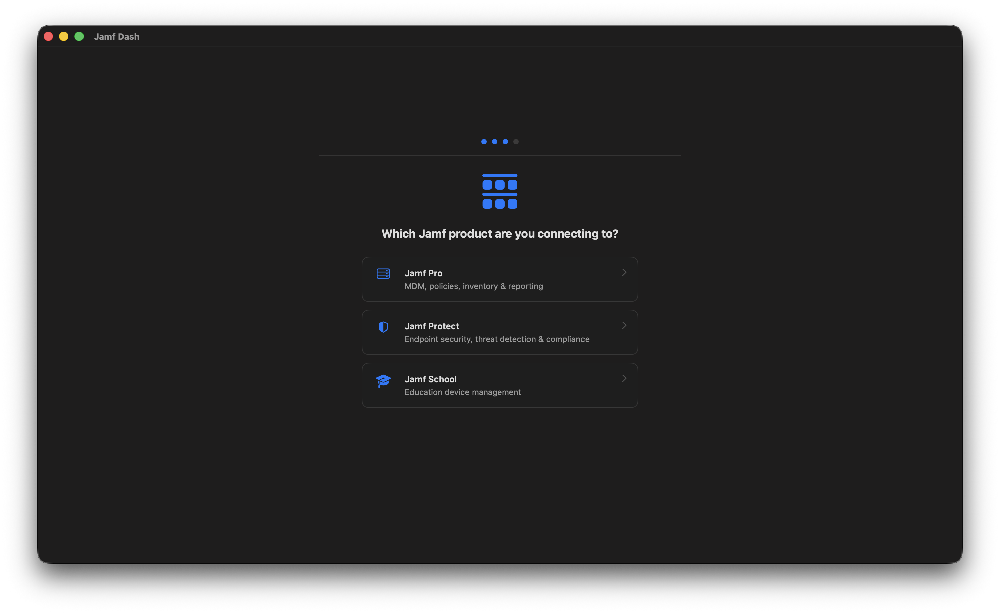

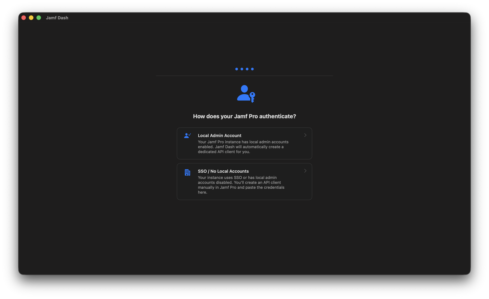

### Jamf Pro — Local Admin Account

If your instance has local admin accounts enabled, enter your server URL, admin username, and password. Jamf Dash will automatically create a dedicated API client.

### Jamf Pro — SSO / No Local Accounts

If your instance uses SSO or has local admin accounts disabled, create an API client manually first:

1. In Jamf Pro go to **Settings → System → API Roles and Clients**
2. Create an **API Role** with the privileges you need
3. Create an **API Client**, assign the role, and save the **Client ID** and **Client Secret** (shown only once)

Then enter the server URL, Client ID, and Client Secret in Jamf Dash.

### Jamf Pro — Platform API

The Platform API unlocks **Blueprints** and **Compliance Benchmarks**. It requires **jamf-cli 1.17 or later** (check and update via **Settings → CLI**).

1. Sign in to [**account.jamf.com**](https://account.jamf.com) and open your tenant
2. Go to **API Clients** and create a new API client
3. Note the **Client ID** and generate a **Client Secret** (shown only once)
4. Copy your **Tenant ID** (the subdomain of your Jamf Cloud URL, e.g. `demo` from `demo.jamfcloud.com`) and the **Gateway URL** shown on the same page

In Jamf Dash, go to **Settings → Connection → Add Connection**, choose **Platform API**, and fill in the Gateway URL, Tenant ID, Client ID, Client Secret, and a profile name.

> **Recommendation:** Use Platform API instead of SSO / Client Credentials when possible — it gives access to the full Jamf platform surface, including features not available through the classic Jamf Pro API.

### Jamf Protect

1. In Jamf Protect go to **Administration → API Clients**
2. Create an API Client and note the **Client ID**
3. Generate a **Client Secret**

Enter the server URL, Client ID, and Client Secret in Jamf Dash.

### Jamf School

1. In Jamf School go to **Organisation → API**
2. Note your **Network ID** and generate an **API Key**

Enter the server URL, Network ID, and API Key in Jamf Dash.

---

## Keyboard Shortcuts

| Shortcut | Action |
|---|---|
| `Cmd+R` | Refresh the current view's data |
| `Cmd+K` | Jump to Device Search (Device Lookup) |
| `Cmd+F` | Focus the search field in the current view |
| `Cmd+1` through `Cmd+9` | Navigate to sidebar items 1–9 for the active product |
| `Cmd+?` | Open Help window |

---

## Features

### Jamf Pro

**Overview**
High-level statistics from the Jamf Pro overview endpoint — device counts, licence usage, health alerts, certificate expiry, and more.

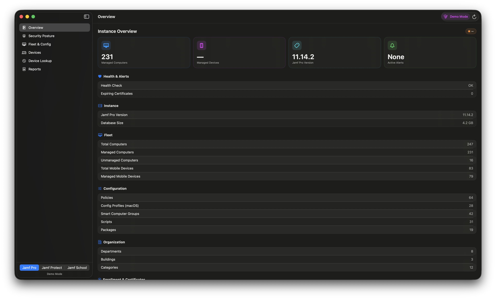

**Security Posture**
A full security compliance report including:
- Compliance summary (FileVault, Gatekeeper, SIP, Firewall) with percentage bars
- OS version distribution donut chart
- Per-device security breakdown table with selectable serial numbers

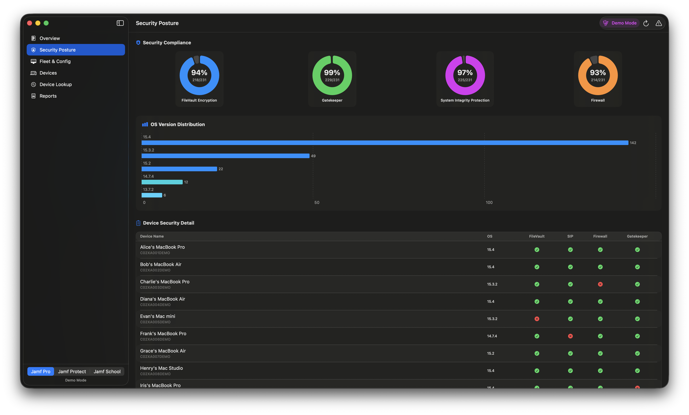

**Fleet & Config**
Browse all configuration objects in one place, with inline detail sheets:

- **Policies** — grouped by category. Click any policy to see its full scope: included computer groups, computers, departments, buildings, and exclusions.
- **Smart Computer Groups** — click any group to view a visual criteria inspector showing each criterion with logical connector badges (IF / AND / OR), optional parenthesis grouping, criterion name, search-type chip, and copyable monospaced value. A read-only banner notes that editing requires the Jamf Pro web console.
- **Scripts** — grouped by category.
- **Packages** — full package inventory.
- **Configuration Profiles** — grouped by category. Click any profile to see its scope.

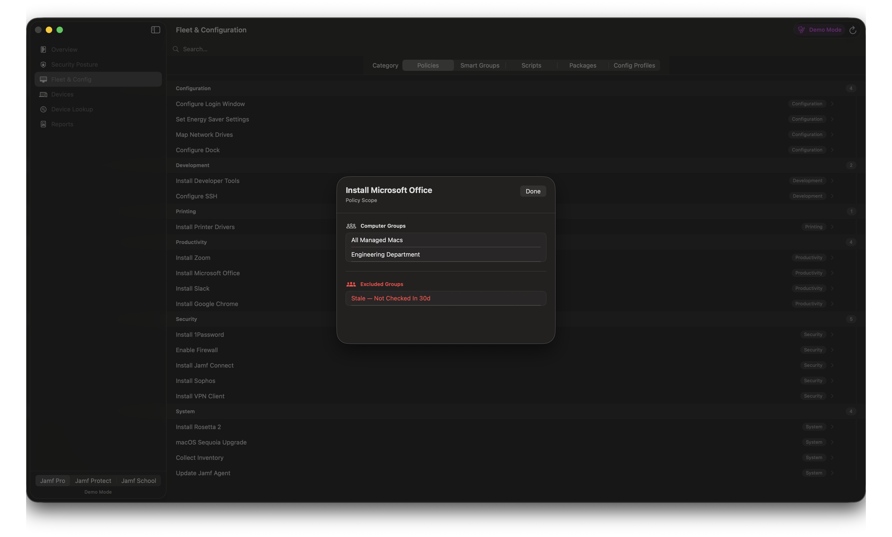
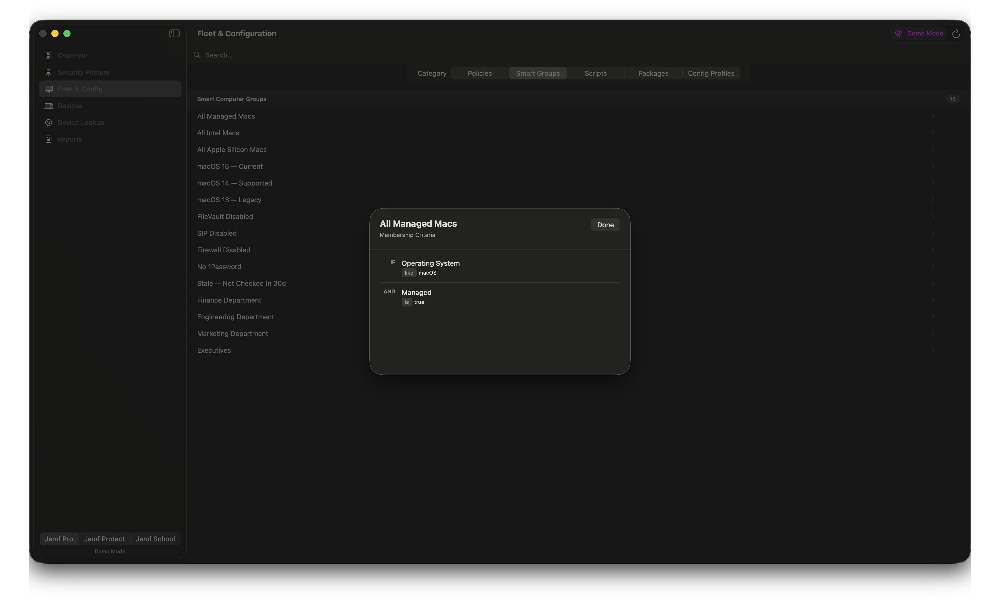
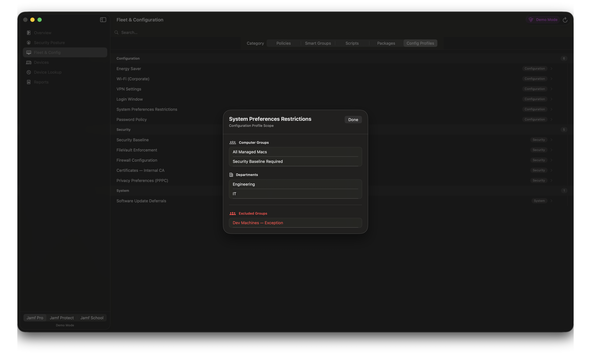

**Devices**
Three-tab Mac inventory view:
- *All Devices* — searchable list with name, serial, OS version, and last contact time
- *Stale Check-in* — devices not checked in within a configurable number of days (adjustable stepper, default 30 days)
- *macOS Versions* — interactive donut chart with a version legend; click a segment to filter devices by that version

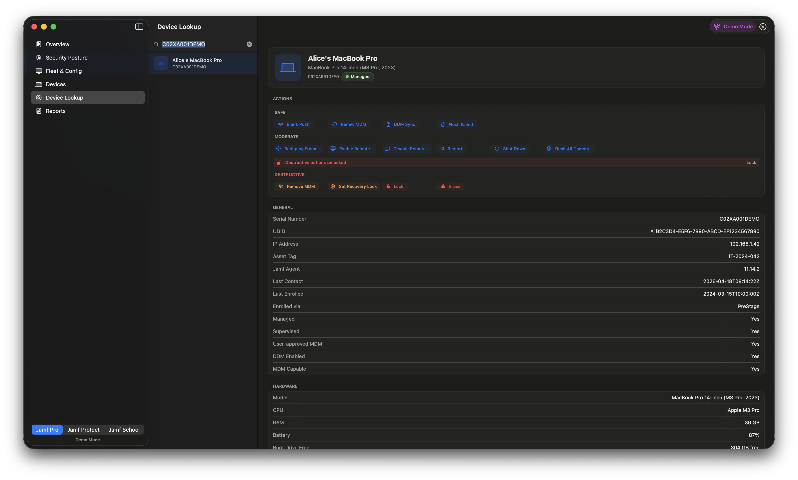

Serial numbers and device names are text-selectable for easy copying.

**Mobile Devices**
iOS and iPadOS device inventory with the same filtering and search capabilities as the Mac Devices view.

**Device Lookup**
Look up any Mac by serial number and view full hardware, OS, security, location, storage, network, and configuration profile detail. Smart Groups, Static Groups, Local Users, Configuration Profiles, and Extension Attributes are shown in collapsible sections. A Device History panel at the bottom shows enrollment timeline (first enrolled, last re-enrolled, last check-in), enrollment method, and placeholder sections for MDM command history and user assignment history. Run management actions directly from the detail panel:
- Safe: Blank Push, Renew MDM, DDM Sync, Flush Failed Commands, Flush All Commands
- Moderate: Redeploy Framework, Enable/Disable Remote Desktop, Restart, Shutdown
- Destructive (confirmation required): Remove MDM, Set Recovery Lock, Lock (with PIN), Erase

**Reports**
Eight built-in CSV report types, each displayed in a full-width interactive table with an **Export CSV** button:

| Report | Contents |
|---|---|
| Patch Status | Patch compliance per computer and title |
| Policy Status | Policy execution results per device |
| Profile Status | Configuration profile deployment status |
| App Status | Managed app install status per device |
| Update Status | macOS software update status (optional failures-only filter) |
| Device Compliance | Overall compliance summary per device |
| Inventory Summary | Full inventory snapshot |
| Software Installs | Installed software across the fleet |

A **PDF Export** option generates a formatted PDF containing your Overview and Security Posture data, optionally branded with your company logo (upload via **Settings → Branding**).

**Bulk Actions**
Run a management command against a target without leaving the app. Supported operations:
- Inventory Update (Recon)
- Policy Trigger
- MDM Push
- Remote Lock (with PIN)
- Remote Erase

**Org Browser**
Browse foundational Jamf Pro org objects across three tabs: Buildings, Departments, and Network Segments.

**Extension Attributes**
View all computer extension attributes — name, data type, and input type — in a searchable table. Click any row to open a detail sheet showing the full description, inventory display category, enabled state, and — for script-based attributes — the complete script contents in a scrollable monospaced editor.

**Patch Management**
Two-tab view covering all configured Patch Titles and Patch Policies, including patch version and enablement status.

**Enrollment & Prestages**
Three-tab enrollment dashboard:
- *DEP Tokens* — Apple Business Manager / Apple School Manager tokens with associated organisation name and expiry date (renew before expiry to avoid enrollment interruptions)
- *Computer Prestages* — all configured Mac prestages with MDM removable flag
- *Mobile Device Prestages* — all configured iOS/iPadOS prestages

**Blueprints** *(requires Platform API, jamf-cli 1.17+)*
Browse all DDM (Declarative Device Management) blueprints. Select any blueprint to see a structured detail view: deployment state badge, last deployment timestamp, scope, and the complete set of declarations. Each declaration card shows its type, channel, and all payload settings as key-value rows — booleans are displayed with checkmark/cross icons; nested objects are expanded inline.

**Compliance Benchmarks** *(requires Platform API, jamf-cli 1.17+)*
List all configured compliance benchmarks. Select a benchmark to view its name, status badge, associated controls, and individual rules. Click **Load Compliance Results** to fetch the current benchmark results for your fleet.

---

### AI Assistant (Dashie)

Dashie is an on-device AI fleet assistant powered by Apple Intelligence (macOS 26+). Open the assistant panel from the toolbar.

**Capabilities:**
- Fleet-wide questions: device counts, compliance percentages, OS distribution, patch status
- Device lookup: hardware specs, installed apps, smart group memberships
- Security posture: FileVault, SIP, Gatekeeper, and firewall compliance breakdowns
- Management actions: blank push, MDM profile renew, redeploy framework, restart (each requires explicit confirmation)

**Requirements:**
- macOS 26 or later
- Apple Intelligence enabled (System Settings → Apple Intelligence & Siri)
- An eligible device (Apple Silicon Mac or qualifying Intel Mac)

**Context compaction:**
When a conversation grows large, Dashie automatically summarises the history into a compact JSON file — capturing message counts, key topics, devices discussed, actions taken, and important findings — then continues seamlessly with a fresh context. Summaries are saved to `~/Library/Application Support/JamfDash/conversation-summary-<timestamp>.json` and the path is shown in the chat.

**Limitations:**
Dashie cannot create, update, or delete Jamf Pro objects. For configuration changes use the Jamf Pro web console. All data stays on-device.

---

### Jamf Protect

**Overview**
Deployment and threat summary statistics from the Protect overview endpoint.

**Events**
Recent threat and detection events stream.

**Computers**
Table of enrolled computers showing host name, serial number, OS version, assigned plan, and last check-in time.

**Plans**
All configured Protect plans with action config, telemetry, log level, and auto-update flag. Click any row for a full detail sheet.

**Alerts**
Active alerts with severity, host, and timestamp.

**Insights**
Protect analytics insights with trend data.

**Audit Logs**
Administrative audit log for your Protect tenant.

**Removable Storage Control Sets**
All configured removable storage control sets with name, description, and enabled state.

**Unified Logging Filters**
Custom unified logging filter configurations.

**Action Configs**
All action configurations (response actions attached to analytics).

**Telemetry Configurations**
Telemetry collection configurations with name, description, and enabled state.

**Custom Prevent Lists**
All configured custom prevent lists.

**Roles**
All Protect roles with name, description, and assigned permissions count.

**Users**
All Protect user accounts with email address, assigned role, and group membership count.

**Groups**
All Protect groups with name and member count.

**API Clients**
All configured Protect API clients — name, role, and creation date.

**Config-as-Code Export**
Export any Protect resource to YAML from the sheet available in the Protect sections. Select a resource type from the sidebar, preview the generated YAML in the editor pane, then copy to clipboard or save to disk.

---

### Jamf School

**Overview**
Summary statistics for your school — device counts, user counts, groups, classes, and deployed apps.

**Devices**
Table of all enrolled devices with name, serial number, model, OS version, and managed status.

**Device Groups**
All configured device groups.

**Users**
All school users with name, username, and email.

**User Groups**
All configured user groups.

**Classes**
All class assignments.

**Apps**
List of managed apps deployed in your School environment.

---

## Multi-Connection Support

Jamf Dash supports multiple `jamf-cli` profiles — for example, separate Jamf Pro instances, or connections to both Pro and Protect. Add connections at any time from **Settings → Connection → Add Connection**. All credentials are stored securely in the system keychain by `jamf-cli`.

Use the **profile picker at the bottom of the sidebar** to switch between configured instances. All subsequent API calls will use the selected profile.

---

## Demo Mode

Jamf Dash includes a Demo Mode that shows synthetic data without any Jamf connection or credentials. Enable it from:
- The **Welcome** screen during onboarding — click **Try Demo**
- **Settings → CLI → Demo** — click **Enable Demo Mode** after the app is set up

In Demo Mode a banner appears in the toolbar and a product switcher (Pro / Protect / School) appears at the bottom of the sidebar so you can explore all three products.

---

## Settings

| Tab | Options |
|---|---|
| Connection | View configured connections, add new connections (Pro local account, Pro SSO, Pro Platform API, Protect, School) |
| Profile | Select which `jamf-cli` profile to use for API calls |
| CLI | View installed `jamf-cli` version, check for updates, update the binary, enable Demo Mode |
| Branding | Upload a company logo to include in exported PDF reports |
| Backup | Select Jamf Pro resources and export them to JSON files in a timestamped folder for archiving or diffing |

---

## jamf-cli Updates

Jamf Dash checks for `jamf-cli` updates automatically on launch. When a newer version is available, an **Update** button appears in the toolbar. You can also check manually from **Settings → CLI**.

---

## License

This project is provided as-is. See [LICENSE](LICENSE) for details.
