# Jamf Dash
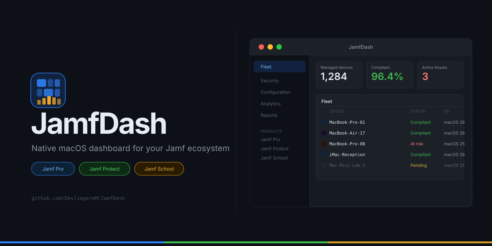

A native macOS dashboard for Jamf Pro, Jamf Protect, and Jamf School. Browse your fleet, review security posture, inspect configuration and analytics, manage enrollment, and export reports — all from one app.

---

## Overview

Jamf Dash connects to your Jamf environment via [`jamf-cli`](https://github.com/jamf-concepts/jamf-cli), an open-source CLI maintained by Jamf Concepts. The app downloads and manages `jamf-cli` automatically — no manual installation required.

**Supported products:**

| Product | Sections |
|---|---|
| Jamf Pro | Overview · Security Posture · Fleet & Config · Devices · Mobile Devices · Device Lookup · Reports · Org Browser · Extension Attributes · Patch Management · Enrollment · DDM Monitor · Configuration Drift · Audit Dashboard · Settings Inspector · Blueprints · Compliance Benchmarks · AI Assistant |
| Jamf Protect | Overview · Alerts · Computers · Plans · Analytics · Analytic Sets · Audit Logs · Removable Storage · Unified Logging · Action Configs · Telemetry · Prevent Lists · Roles · Users · Groups · API Clients |
| Jamf School | Overview · Devices · Device Groups · Users · User Groups · Classes · Apps |
| Cross-product | Device Correlation *(requires both Pro and Protect)* |

---

## Requirements

- macOS 14 Sonoma or later
- A Jamf Pro, Jamf Protect, or Jamf School account with API access
- An internet connection for the initial `jamf-cli` download
- `jamf-cli` 1.31.1 or later — Jamf Dash installs it, and updates an older version automatically

---

## Setup

Jamf Dash guides you through a step-by-step onboarding flow on first launch:

1. **Welcome** — introduction, or try Demo Mode without any credentials
2. **Install jamf-cli** — the binary is downloaded automatically from Jamf Concepts
3. **Choose product** — Jamf Pro, Jamf Protect, or Jamf School
4. **Authenticate** — product-specific credentials (see below)

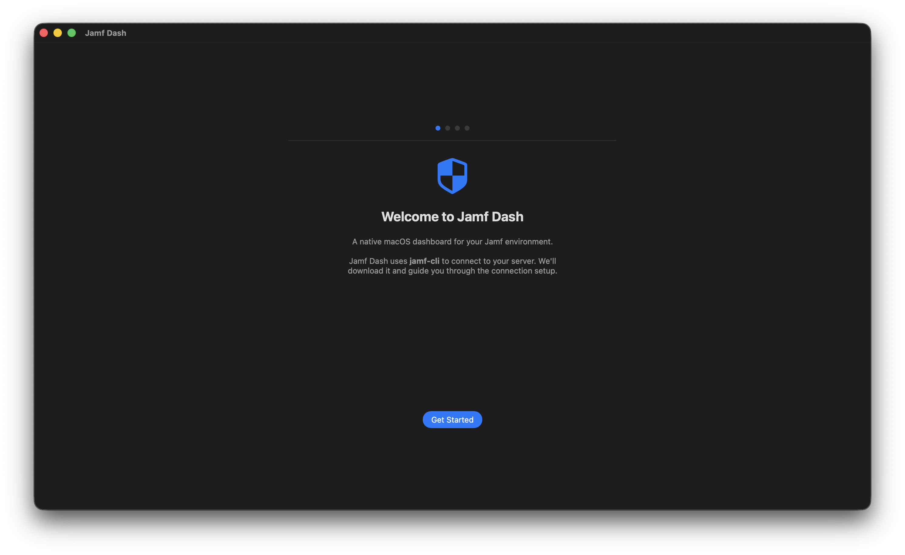

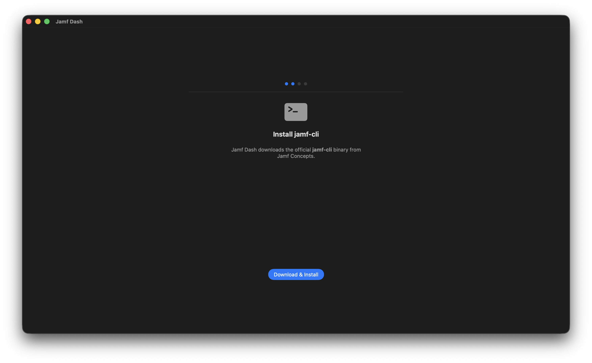

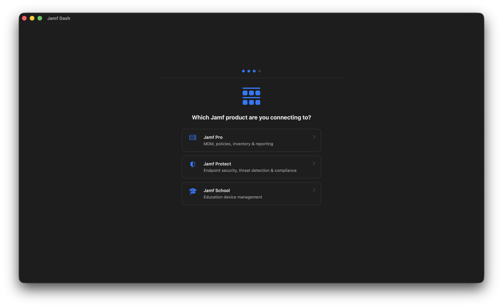

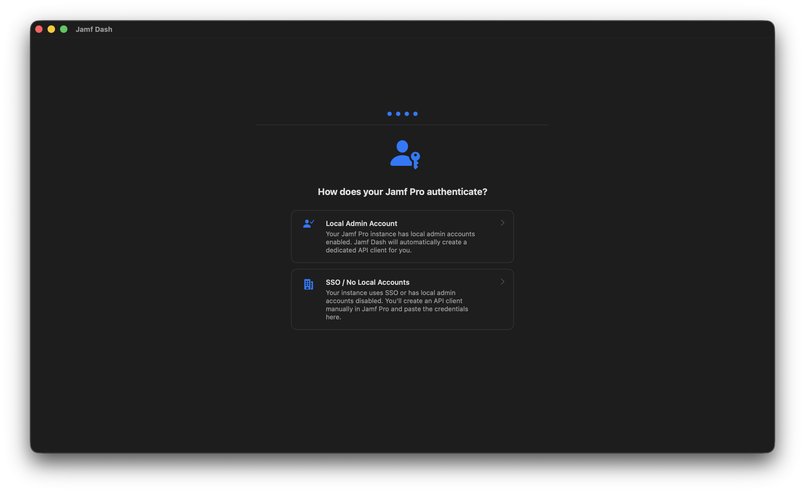

### Jamf Pro — Platform API (recommended)

> **Recommended: Jamf Platform API (environment level).** The only connection that shows every section, including Blueprints and Compliance Benchmarks. Create the API integration at the *platform environment* level in Jamf Account, not for a single tenant — a tenant-level integration can't read Blueprints or Compliance Benchmarks.
>
> *Device actions (lock, restart, recovery lock, …) aren't available through the Platform API yet. Jamf is still expanding it, so more will become available over time. Until then, add a Jamf Pro API client connection for device actions.*

1. Sign in to [**account.jamf.com**](https://account.jamf.com)
2. Create an API integration at the **platform environment** level
3. Give it read access, including *Deployment → Blueprints: Read* and *Compliance → Compliance Benchmarks: Read*
4. Note the **Client ID** and **Environment ID**, and generate a **Client Secret** (shown only once)

In Jamf Dash, go to **Settings → Connection → Add Connection**, choose **Platform API**, and pick your **Region** (US, EU or APAC), **Environment ID**, the Client ID and Client Secret, and a profile name.

Jamf Dash checks what the active connection can read: when a connection can't load Blueprints or Compliance Benchmarks, they are greyed out with the reason. Profiles created with the retired `*.apigw.jamf.com` gateway are moved to the new `https://<region>.api.jamfcloud.com` gateway automatically the first time Jamf Dash uses them.

> Local Jamf Pro accounts (used by the **Local Admin** option below) are deprecated for cloud-hosted Jamf Pro, with removal expected in the second half of 2027.

### Jamf Pro — Local Admin Account

If your instance has local admin accounts enabled, enter your server URL, admin username, and password. Jamf Dash will automatically create a dedicated API client.

### Jamf Pro — SSO / No Local Accounts

If your instance uses SSO or has local admin accounts disabled, create an API client manually first:

1. In Jamf Pro go to **Settings → System → API Roles and Clients**
2. Create an **API Role** with the privileges you need
3. Create an **API Client**, assign the role, and save the **Client ID** and **Client Secret** (shown only once)

Then enter the server URL, Client ID, and Client Secret in Jamf Dash.

### Jamf Protect

1. In Jamf Protect go to **Administration → API Clients**
2. Create an API Client and note the **Client ID**
3. Generate a **Client Secret**

Enter the server URL, Client ID, and Client Secret in Jamf Dash.

### Jamf School

1. In Jamf School go to **Organisation → API**
2. Note your **Network ID** and generate an **API Key**

Enter the server URL, Network ID, and API Key in Jamf Dash.

---

## Keyboard Shortcuts

| Shortcut | Action |
|---|---|
| `Cmd+R` | Refresh the current view's data |
| `Cmd+K` | Jump to Device Search (Device Lookup) |
| `Cmd+F` | Focus the search field in the current view |
| `Cmd+1` through `Cmd+9` | Navigate to sidebar items 1–9 for the active product |
| `Cmd+?` | Open Help window |

---

## Features

### Jamf Pro

**Overview**
High-level statistics from the Jamf Pro overview endpoint — device counts, licence usage, health alerts, certificate expiry, and more.

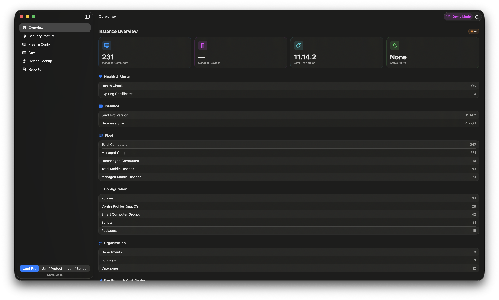

**Security Posture**
A full security compliance report including:
- **Fleet Health Score** — computed 0–100 score (A–F grade) based on FileVault, SIP, Gatekeeper, Firewall, patch compliance, and stale-device ratio. Displayed as a circular gauge at the top of the view with a per-component breakdown. When the score drops below a configurable threshold, the Dock tile badge updates and a macOS notification is posted.
- Compliance summary (FileVault, Gatekeeper, SIP, Firewall) with percentage bars
- OS version distribution bar chart
- Per-device security breakdown table with selectable serial numbers and Jamf Pro deep links

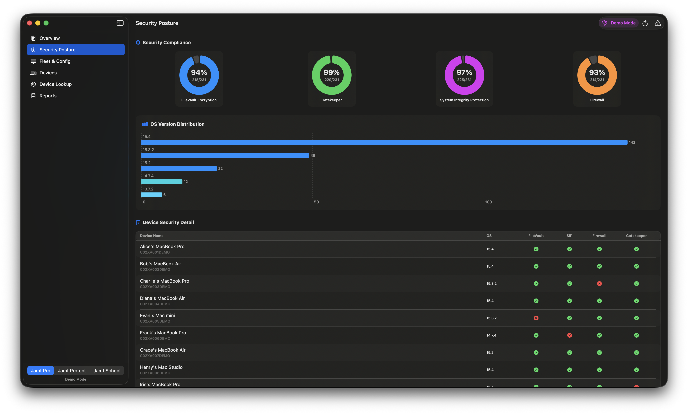

**Fleet & Config**
Browse all configuration objects in one place, with inline detail sheets:

- **Policies** — grouped by category. Click any policy to see its full scope: included computer groups, computers, departments, buildings, and exclusions.
- **Smart Computer Groups** — click any group to view a visual criteria inspector showing each criterion with logical connector badges (IF / AND / OR), optional parenthesis grouping, criterion name, search-type chip, and copyable monospaced value. A read-only banner notes that editing requires the Jamf Pro web console.
- **Scripts** — grouped by category.
- **Packages** — full package inventory.
- **Configuration Profiles** — grouped by category. Click any profile to see its scope.

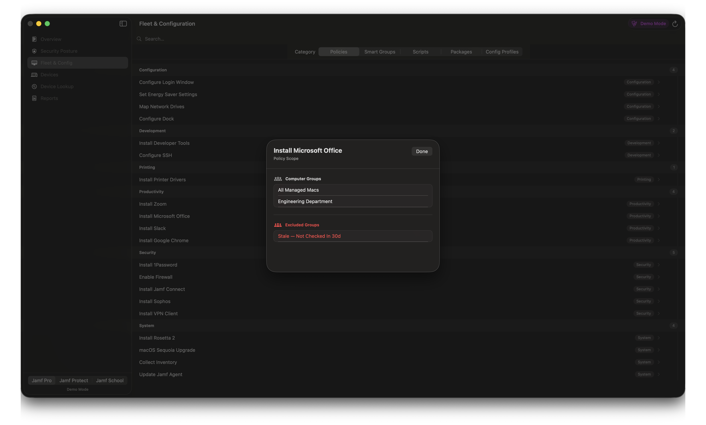
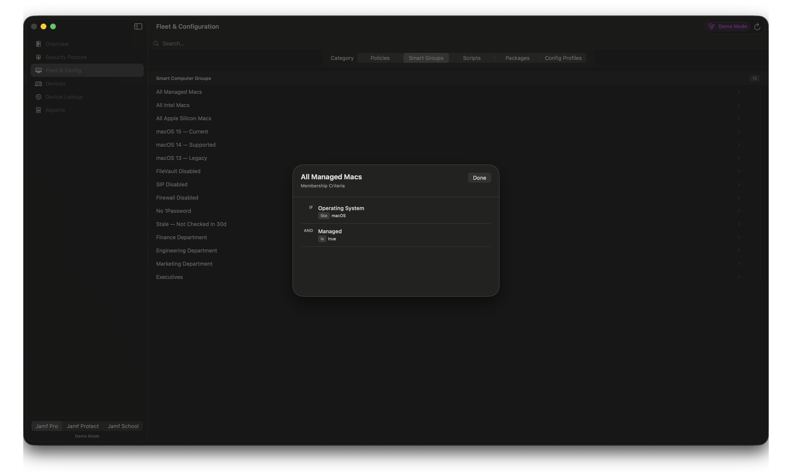
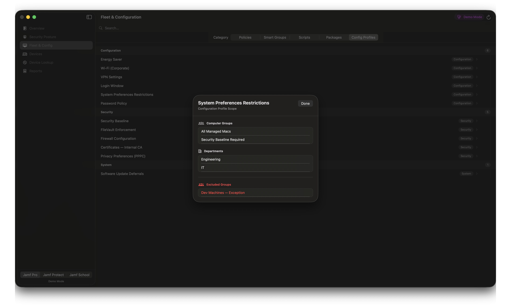

**Devices**
Three-tab Mac inventory view:
- *All Devices* — searchable list with name, serial, OS version, and last contact time
- *Stale Check-in* — devices not checked in within a configurable number of days (type a value directly or use the stepper arrows, default 30 days)
- *macOS Versions* — interactive donut chart with a version legend; click a segment to filter devices by that version

Serial numbers and device names are text-selectable for easy copying.

**Mobile Devices**
iOS and iPadOS device inventory with the same filtering and search capabilities as the Mac Devices view. Device actions: Update Inventory, Restart, Shut Down, Enable Lost Mode (with a message, phone number and footnote), Disable Lost Mode, Erase, Unmanage and Lock.

**Device Lookup**
Look up any Mac by serial number and view full hardware, OS, security, location, storage, network, and configuration profile detail. Smart Groups, Static Groups, Local Users, Configuration Profiles, and Extension Attributes are shown in collapsible sections. A Device History panel at the bottom shows enrollment timeline (first enrolled, last re-enrolled, last check-in), enrollment method, and placeholder sections for MDM command history and user assignment history. Run management actions directly from the detail panel:
- Safe: Blank Push, Renew MDM, DDM Sync, Flush Failed Commands, Flush All Commands
- Moderate: Redeploy Framework, Enable/Disable Remote Desktop, Restart, Shutdown
- Destructive (confirmation required): Remove MDM, Clear Recovery Lock, Lock (with PIN), Erase

Which actions are available depends on the connection's permission level (Settings → Connection).

A **Software Update Readiness** section shows whether the Mac is ready for macOS 27 update management (see *Update Readiness* below).

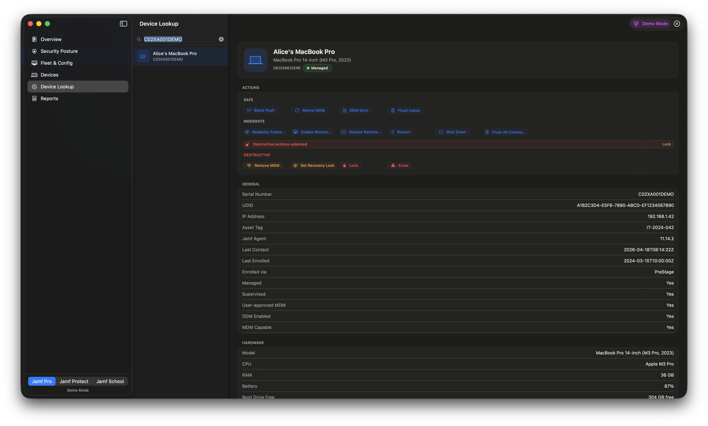

**Reports**
Eight built-in CSV report types, each displayed in a full-width interactive table with an **Export CSV** button:

| Report | Contents |
|---|---|
| Patch Status | Patch compliance per computer and title |
| Policy Status | Policy execution results per device |
| Profile Status | Configuration profile deployment status |
| App Status | Managed app install status per device |
| Update Status | macOS software update status (optional failures-only filter) |
| Device Compliance | Overall compliance summary per device |
| Inventory Summary | Full inventory snapshot |
| Software Installs | Installed software across the fleet |

A **PDF Export** option generates a formatted PDF containing your Overview and Security Posture data, optionally branded with your company logo (upload via **Settings → Branding**).

**Org Browser**
Browse foundational Jamf Pro org objects across three tabs: Buildings, Departments, and Network Segments.

**Extension Attributes**
View all computer extension attributes — name, data type, and input type — in a searchable table. Click any row to open a detail sheet showing the full description, inventory display category, enabled state, and — for script-based attributes — the complete script contents in a scrollable monospaced editor.

**Patch Management**
Two-tab view covering all configured Patch Titles and Patch Policies, including patch version and enablement status.

**Enrollment & Prestages**
Three-tab enrollment dashboard:
- *DEP Tokens* — Apple Business Manager / Apple School Manager tokens with associated organisation name and expiry date (renew before expiry to avoid enrollment interruptions)
- *Computer Prestages* — all configured Mac prestages with MDM removable flag
- *Mobile Device Prestages* — all configured iOS/iPadOS prestages

**DDM Monitor**
Declarative Device Management status in four views:
- *Per Device* — searchable device list on the left; select any device to see its full DDM declaration status items on the right, including each declaration identifier, status, and any errors reported by the device. A summary card highlights enrollment type, Lockdown Mode and other status items, and tags keys introduced in OS 27.
- *Fleet Overview* — table showing all declarations across the fleet with counts of succeeded, failed, and pending devices per declaration, plus a **Declaration coverage** bar (DDM-enabled devices vs. inventory and overall success rate).
- *Status Items* — every DDM device in one table with sortable, filterable columns for the status items reported by the device.
- *Update Readiness* — see below.

If your Jamf Pro version no longer serves a DDM endpoint, the monitor says so instead of showing an empty list.

**Update Readiness** *(macOS 27)*
macOS 27 removes the legacy MDM software update commands and the software update deferral restrictions — updates are managed declaratively only. Update Readiness checks every Mac against that change: OS version, whether DDM is enabled, Managed Software Update plans, reported update status, and any installed profiles that still carry deferral or Software Update payloads. Each Mac gets a readiness level with the reason and what to change.

**Configuration Drift**
Point-in-time snapshots of your Jamf Pro policies, configuration profiles, and scripts stored locally in SQLite. Click **Snapshot Now** to capture the current state. Each subsequent snapshot is diffed against the previous one and any Added, Modified, or Removed objects appear in a chronological timeline grouped by date.

- Color-coded rows: green for additions, yellow for modifications, red for removals
- Filter by object type (All · Policies · Profiles · Scripts)
- Tap any row to open a diff sheet showing field-level changes (old value vs new value)
- Snapshot history persists across app restarts at `~/Library/Application Support/JamfDash/drift.db`

**Audit Dashboard**
Cross-checks your Jamf Pro environment against a built-in set of security and hygiene rules and surfaces findings with severity ratings (Critical · High · Medium · Low · Info):

- Summary bar showing finding counts per severity
- Filter by severity or search by keyword
- Click any finding for a detail sheet with a full description and remediation guidance
- Findings refresh on demand or on each view load
- **OS 27 deprecation rules** — flags configuration profiles using payloads that are removed or deprecated in macOS 27 (Software Update payload, update deferral restrictions, `com.apple.applicationaccess.new`, `com.apple.AssetCache.managed`, DNS settings / DNS proxy / relay) and names the declaration that replaces each. The detail sheet lists the affected profiles.

**Settings Inspector**
Browse all Jamf Pro settings endpoints exposed by `jamf-cli` in a searchable two-pane layout — settings category list on the left, raw structured output on the right. Useful for auditing configuration values without opening the Jamf Pro web console.

**Blueprints** *(requires a Platform API connection at environment level)*
Browse all DDM (Declarative Device Management) blueprints. Select any blueprint to see a structured detail view: deployment state badge, last deployment timestamp, scope, and the complete applied settings. The **Scope** section lists the exact device group and device names the blueprint is deployed to. Each declaration card humanises the type identifier (e.g. `com.jamf.ddm.passcode-settings` → **Passcode Settings**), renders all payload keys as readable label/value rows, and displays booleans as checkmark/cross icons.

**Compliance Benchmarks** *(requires a Platform API connection at environment level)*
List all configured compliance benchmarks. Select a benchmark to view its name, status badge, framework version, and rule summary. The **Applied To** section shows which device groups, devices, users, and user groups the benchmark is scoped to. Rules are grouped into **Active** and **Inactive** sections; expand any rule row to read its full description and remediation guidance inline.

---

### AI Assistant (Dashie)

Dashie is an on-device AI fleet assistant powered by Apple Intelligence (macOS 26+). Open the assistant panel from the toolbar.

**Capabilities:**
- Fleet-wide questions: device counts, compliance percentages, OS distribution, patch status
- Device lookup: hardware specs, installed apps, smart group memberships
- Security posture: FileVault, SIP, Gatekeeper, and firewall compliance breakdowns
- Management actions: blank push, MDM profile renew, redeploy framework, flush failed commands, restart, and bulk enable/disable policies. These are **off by default**; turn them on in **Settings → Dashie**. Every action asks for your confirmation, showing what Jamf Dash looked up itself, before anything is sent.

**Requirements:**
- macOS 26 or later
- Apple Intelligence enabled (System Settings → Apple Intelligence & Siri)
- An eligible device (Apple Silicon Mac or qualifying Intel Mac)

**Context compaction:**
When a conversation grows large, Dashie summarises the earlier part (topics, devices, actions and key findings, including what its tools returned) and continues with that summary. The summary stays in memory only; nothing is written to disk.

**Fleet index:**
After each sync Dashie keeps a local keyword index of policy, configuration profile, script, package, smart group and Mac names, blueprint states, compliance results and recent daily digests. Ask things like "What do we have for FileVault?". The index is stored in Application Support (readable only by you), is never added to Spotlight, and is cleared when you switch to another Jamf instance.

**macOS 27:**
Dashie uses the new on-device model features: it measures its context window (8 192 tokens on current models) and sizes tool results to match, shortens older tool results automatically so long chats keep fitting, and shows which tool it is running. On Macs whose model supports vision you can attach, paste or drop a screenshot and ask about it — the image is read on your Mac. Everything runs on-device; Dashie does not use Private Cloud Compute.

**Limitations:**
Apart from enabling or disabling policies, Dashie cannot create, update, or delete Jamf Pro objects. For configuration changes use the Jamf Pro web console. All data stays on your Mac.

---

### Shortcuts & Siri

Jamf Dash provides read-only App Intents you can use in Shortcuts, Spotlight and Siri:
- **Get Fleet Compliance** — the fleet's security compliance percentage
- **Get Devices Needing Updates** — Macs with pending software updates
- **Get DDM Declaration Failures** — declarations failing across the fleet

---

### Device Correlation *(requires Jamf Pro + Jamf Protect)*

When both Jamf Pro and Jamf Protect are connected, the Device Correlation view joins the two device inventories by serial number and presents a unified table:

- **Match status** — Matched (in both products), Pro Only, or Protect Only, shown as a color-coded dot
- **Columns** — device name, serial, Protect plan, last Protect check-in, OS version, last Pro contact
- **Filter** by match state or search by name/serial
- **Detail panel** — select any device to expand an inline split panel: left side shows Protect-specific data (plan, agent version, alert count, FDA status, web protection), right side shows Pro-specific data (managed status, OS, last contact) with quick-action buttons

Summary chips in the toolbar show the total matched, Pro-only, and Protect-only counts at a glance.

---

### Jamf Protect

**Overview**
Deployment and threat summary statistics from the Protect overview endpoint.

**Alerts**
Protect alerts with severity, status, analytic, host and time. Filter by severity or status and search by analytic or host.

**Computers**
Table of enrolled computers showing host name, serial number, OS version, assigned plan, and last check-in time.

**Plans**
All configured Protect plans with action config, telemetry, log level, and auto-update flag. Click any row for a full detail sheet.

**Analytics**
All Protect analytics with their severity and categories.

**Analytic Sets**
Analytic sets and the analytics they contain.

**Audit Logs**
Administrative audit log for your Protect tenant.

**Removable Storage Control Sets**
All configured removable storage control sets with name, description, and enabled state.

**Unified Logging Filters**
Custom unified logging filter configurations.

**Action Configs**
All action configurations (response actions attached to analytics).

**Telemetry Configurations**
Telemetry collection configurations with name, description, and enabled state.

**Custom Prevent Lists**
All configured custom prevent lists.

**Roles**
All Protect roles with name, description, and assigned permissions count.

**Users**
All Protect user accounts with email address, assigned role, and group membership count.

**Groups**
All Protect groups with name and member count.

**API Clients**
All configured Protect API clients — name, role, and creation date.

---

### Jamf School

**Overview**
Summary statistics for your school — device counts, user counts, groups, classes, and deployed apps.

**Devices**
Table of all enrolled devices with name, serial number, model, OS version, and managed status.

**Device Groups**
All configured device groups.

**Users**
All school users with name, username, and email.

**User Groups**
All configured user groups.

**Classes**
All class assignments.

**Apps**
List of managed apps deployed in your School environment.

---

## Multi-Connection Support

Jamf Dash supports multiple `jamf-cli` profiles — for example, separate Jamf Pro instances, or connections to both Pro and Protect. Add connections at any time from **Settings → Connection → Add Connection**. All credentials are stored securely in the system keychain by `jamf-cli`.

Use the **profile picker at the bottom of the sidebar** to switch between configured instances. All subsequent API calls will use the selected profile.

---

## Demo Mode

Jamf Dash includes a Demo Mode that shows synthetic data without any Jamf connection or credentials. Enable it from:
- The **Welcome** screen during onboarding — click **Try Demo**
- **Settings → CLI → Demo** — click **Enable Demo Mode** after the app is set up

In Demo Mode a banner appears in the toolbar and a product switcher (Pro / Protect / School) appears at the bottom of the sidebar so you can explore all three products.

---

## Settings

| Tab | Options |
|---|---|
| Connection | View configured connections, add new connections (Pro local account, Pro SSO, Pro Platform API, Protect, School) |
| Profile | Select which `jamf-cli` profile to use for API calls |
| CLI | View installed `jamf-cli` version, check for updates, update the binary, enable Demo Mode |
| Branding | Upload a company logo to include in exported PDF reports |
| Export Lists | Save Jamf Pro lists (policies, profiles, scripts, packages, groups, extension attributes, patch titles and policies, webhooks) as JSON files in a dated folder. These are lists with names and IDs, not a backup that can be restored |

---

## jamf-cli Updates

Jamf Dash checks for `jamf-cli` updates automatically on launch. When a newer version is available, an **Update** button appears in the toolbar. You can also check manually from **Settings → CLI**.

### Verification

Every `jamf-cli` binary is verified twice before it is used:
- its SHA-256 checksum against the checksum file in the GitHub release, and
- its code signature: it must be signed with JAMF Software's Developer ID (Team ID `483DWKW443`).

The signature is checked when a version is downloaded, when you switch or roll back versions, and before the binary is run. A binary that fails the check is never executed.

`jamf-cli` runs in a separate helper process (`JamfDashCLIWorker`, an XPC service inside the app) that only accepts requests from Jamf Dash and only runs signed `jamf-cli` binaries from Jamf Dash's own folder. To run it inside the app process instead, for troubleshooting:

```bash
defaults write be.devliegere.JamfDash UseInProcessCLI -bool YES
```

---

## Debug Logging

JamfDash emits structured log messages via macOS Unified Logging under the `com.jamfdash` subsystem. Each major area has its own category so you can filter precisely.

### Enable debug mode

Launch with the `--debug` flag to turn on verbose output:

```bash
open -a "JamfDash" --args --debug
```

### Stream logs

In a separate Terminal window:

```bash
# All JamfDash messages
log stream --predicate 'subsystem == "com.jamfdash"' --level debug

# CLI timing only (command duration + response size per call)
log stream --predicate 'subsystem == "com.jamfdash" AND category == "CLIManager"' --level debug

# App lifecycle (phase transitions, sync start/complete)
log stream --predicate 'subsystem == "com.jamfdash" AND category == "AppState"' --level debug

# Sparkle update check results
log stream --predicate 'subsystem == "com.jamfdash" AND category == "Sparkle"' --level debug

# Errors only
log stream --predicate 'subsystem == "com.jamfdash"' --level error
```

### Log categories

| Category | What's logged |
|---|---|
| `AppState` | App phase transitions (`launching → main`, `onboarding → main`, etc.) |
| `AppEnvironment` | Sync start/complete with elapsed time, profile switches, notification counts, health score alerts |
| `CLIManager` | Command arguments (private by default), duration, response size in bytes, errors |
| `Sparkle` | Update check results, download progress, install errors |
| `FleetViewModel` | Load start/count/error for policies, groups, scripts, packages, profiles; cache-hit skips; total `loadAll` duration |
| `SecurityViewModel` | Security report and patch compliance load with cache-hit skips |
| `DevicesViewModel` | Computer load with cache-hit skips |
| `DDMMonitorViewModel` | Device list, status items, fleet stats; deprecation warnings (exit 15) |
| `DriftViewModel` | Snapshot start/complete with event count |
| `AuditViewModel` | Findings load, decode failures |
| `ProtectViewModel` | Load start/count/error for every Protect data type |
| `SchoolViewModel` | Load start/count/error for every School data type |
| `FleetRepository` | Category back-fill progress (N/M resolved) |
| `OverviewRepository` | Empty response and skipped-field warnings |
| `SecurityRepository` | Schema change warnings |

### Instruments (signpost tracing)

The main sync task groups are instrumented with `OSSignposter` intervals under the `Sync` category. To see them as visual timeline tracks:

1. Open **Instruments** → **Blank** template
2. Add the **os_signpost** instrument
3. Set the process filter to **JamfDash**
4. Record while triggering a sync — a `MainSync` track will appear for each product (Jamf Pro, Protect, School)

### Viewing private log values

Command arguments are marked `.private` by default to protect credentials. To reveal them locally, drop a plist into the logging subsystems directory:

```bash
sudo mkdir -p /Library/Preferences/Logging/Subsystems
sudo tee /Library/Preferences/Logging/Subsystems/com.jamfdash.plist > /dev/null << 'EOF'
<?xml version="1.0" encoding="UTF-8"?>
<!DOCTYPE plist PUBLIC "-//Apple//DTD PLIST 1.0//EN" "http://www.apple.com/DTDs/PropertyList-1.0.dtd">
<plist version="1.0">
<dict>
    <key>Enable-Private-Data</key>
    <true/>
</dict>
</plist>
EOF
```

Remove it when done — it applies to all users on the machine. For fleet-managed Macs, install the included `JamfDash-Debug-Logging.mobileconfig` instead; it scopes the same setting to an MDM enrollment and can be removed remotely.

---

## License

This project is provided as-is. See [LICENSE](LICENSE) for details.
